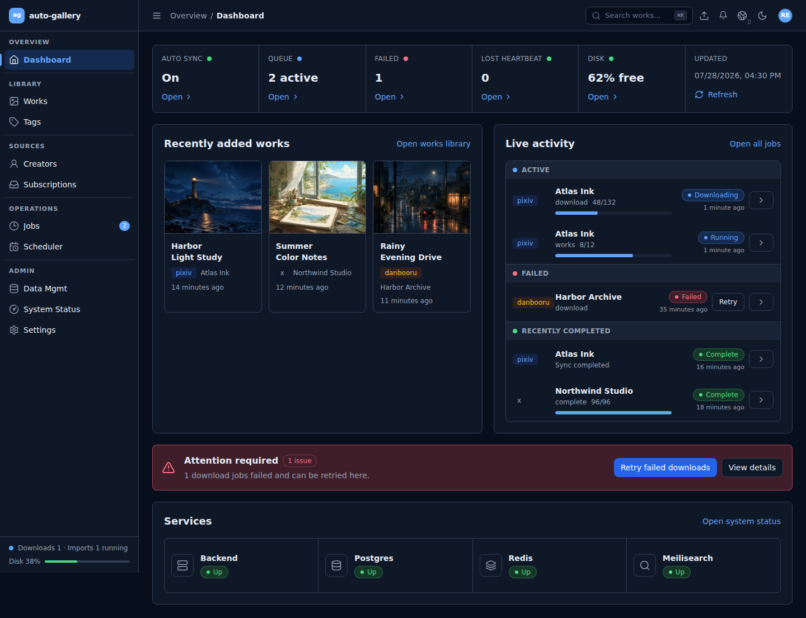
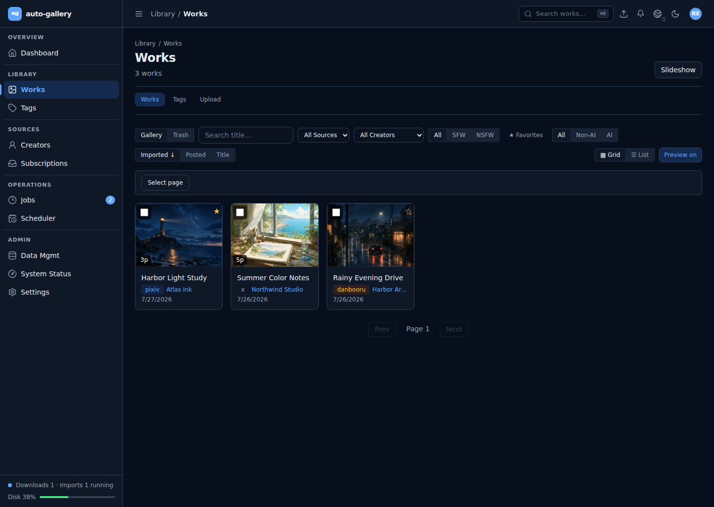
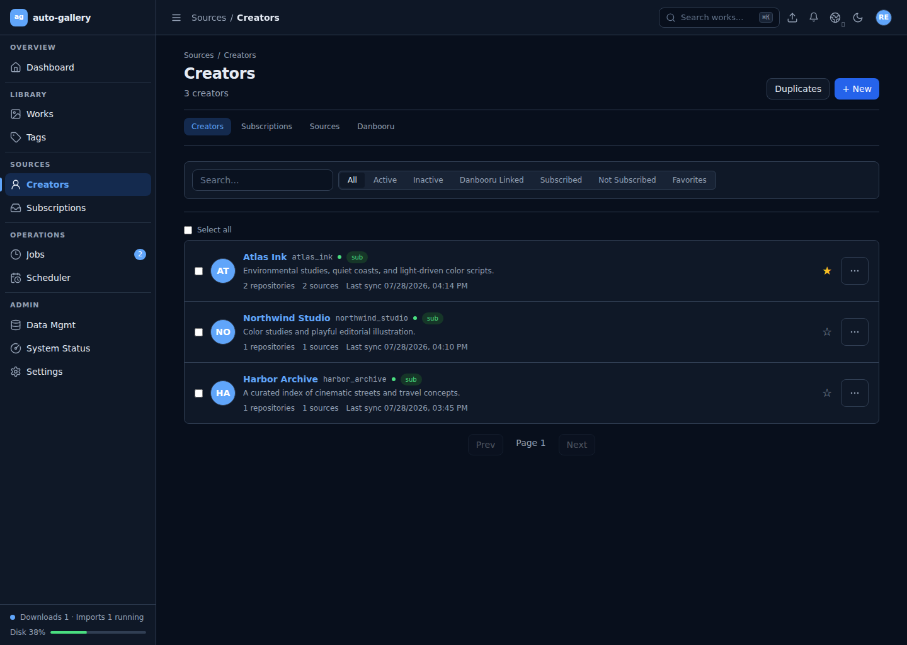
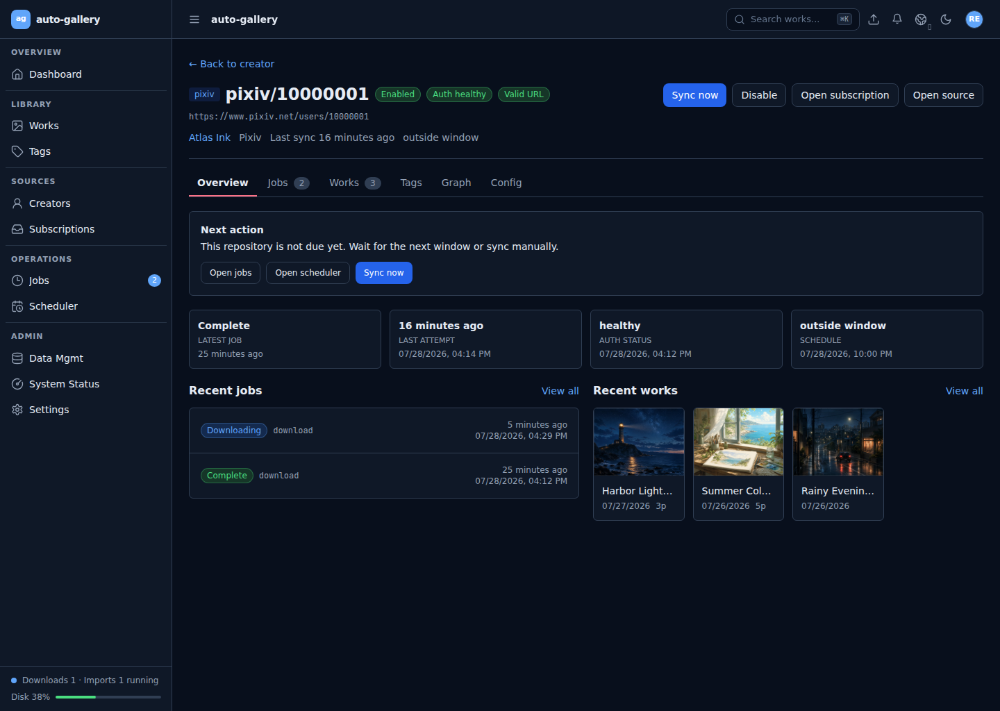
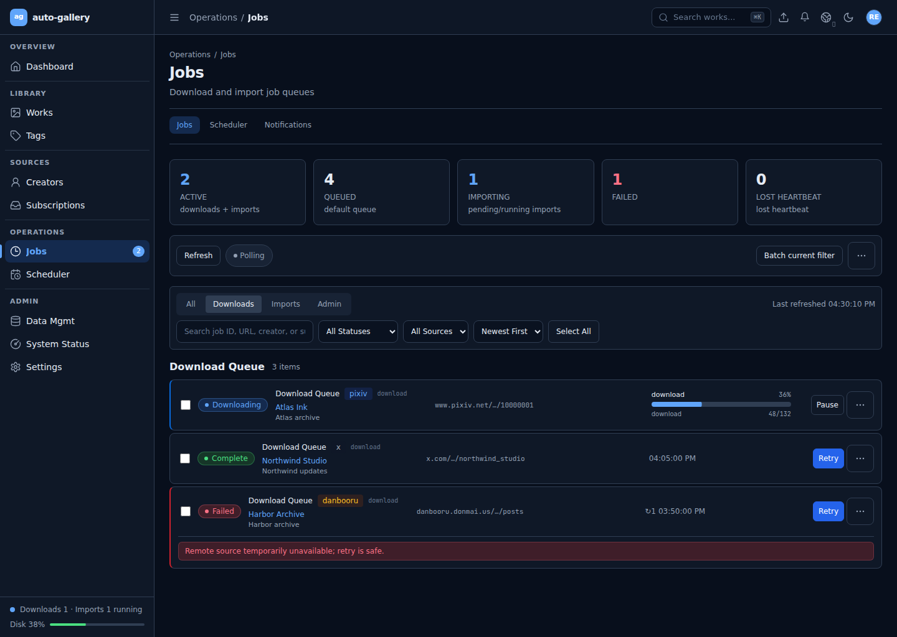
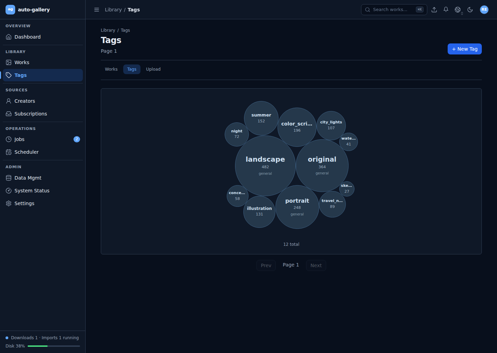
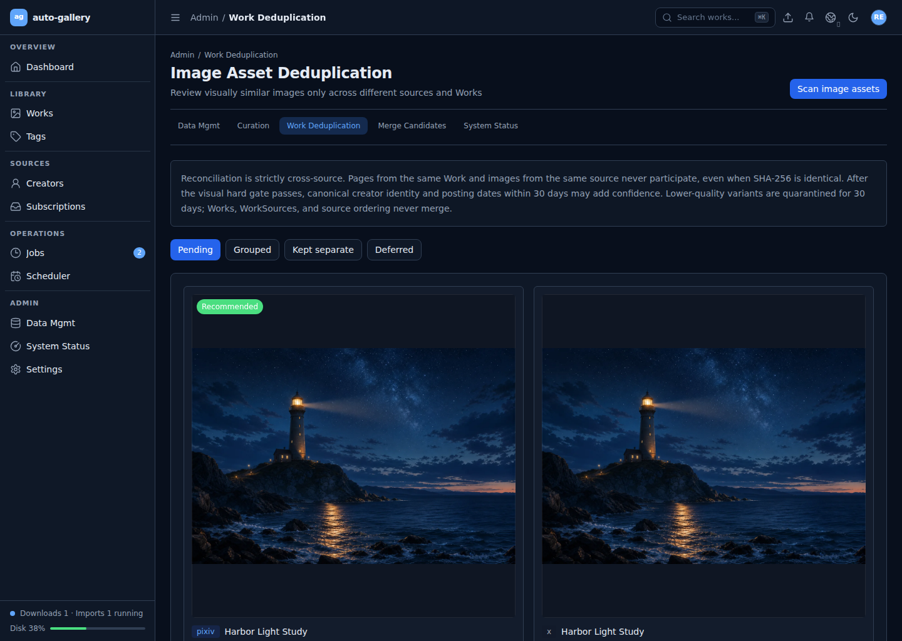

# auto-gallery

[简体中文](README.zh.md)

[](https://github.com/MUSH2077/auto-gallery/actions/workflows/ci.yml)
[](https://github.com/MUSH2077/auto-gallery/actions/workflows/codeql.yml)
[](https://securityscorecards.dev/viewer/?uri=github.com/MUSH2077/auto-gallery)
[](LICENSE)
[](CHANGELOG.md)

Self-hosted media archiving and curation for creator-based collections.

auto-gallery downloads, imports, indexes, and manages media from multiple
sources through a Docker Compose stack. It is designed for personal NAS and
Linux hosts. The responsive admin workspace covers creators, source
repositories, works, tags, subscriptions, queues, scheduling, search, storage,
curation history, and gallery-dl configuration.

> [!WARNING]
> auto-gallery is a pre-1.0 beta for trusted self-hosted environments. Do not
> expose the admin web or backend API directly to the internet. Use a reverse
> proxy, TLS, access controls, and a threat model appropriate for your network.

## Why auto-gallery?

- **Creator-first organization.** One canonical creator can link identities
  and source repositories from multiple platforms.
- **Repository-shaped sync.** Every supported gallery-dl subscription URL is
  an observable, independently scheduled repository with jobs, tags, works,
  health, and history.
- **Original media preservation.** Downloads remain the source of truth while
  PostgreSQL, thumbnails, and Meilisearch provide a browsable library index.
- **Durable operations.** Download, import, recovery, backup, and maintenance
  work run in isolated workers with queue, scheduler, health, and storage
  visibility.
- **Auditable curation.** Reversible curation commits are projected into a
  content-addressed `.gitllery` history for integrity checks and recovery.
- **Cross-source asset deduplication.** Images are compared only across
  different sources and Works. Visual evidence is the hard gate; creator and
  posting-time metadata can raise confidence, while ambiguous cases go to
  human review.
- **Visual exploration.** Responsive work grids, creator storage trees, tag
  bubbles, search, slideshows, and an optional showcase help browse large
  collections.
- **Accessible administration.** Chinese and English UI, module permissions,
  keyboard navigation, touch targets, responsive layouts, dark mode, and
  reduced-motion support.

## Screenshots



### Media library and creators

| Works library | Creator management |
|---|---|
|  |  |

### Repositories and operations

| Repository detail | Job operations |
|---|---|
|  |  |

### Exploration and curation

| Tag distribution | Cross-source asset review |
|---|---|
|  |  |

These screenshots are rendered from the current admin web with intercepted,
fictional fixtures and three generated, copyright-neutral media illustrations.
They contain no
credentials, local paths, private creators, or downloaded media.

## Supported sources

Provider compatibility depends on gallery-dl and can change when a source site
changes. See the [provider guide](docs/providers.md) for current limitations.

| Source | Download | Authentication | Status |
|---|---|---|---|
| Pixiv | gallery-dl | Refresh token or cookies | Supported |
| X/Twitter | gallery-dl `twitter` extractor | Cookies | Supported |
| Iwara | gallery-dl | Username/password or cookies | Supported |
| Danbooru | gallery-dl | API key, username/password, or cookies | Supported |
| Weibo | gallery-dl | Optional cookies | Supported |
| Bilibili | gallery-dl | Public content | Supported |
| Pinterest | gallery-dl | Public content | Supported |
| LOFTER | gallery-dl | Public content | Supported |
| Manual upload | Admin web | Admin user | Supported |
| Local folder | Direct import | Local path | Planned |

## Quick start

### Requirements

- Docker Engine with Docker Compose v2
- A Linux host or NAS with persistent storage
- Sufficient disk capacity for original media, thumbnails, and backups

```bash
git clone https://github.com/MUSH2077/auto-gallery.git
cd auto-gallery

bash scripts/generate-env.sh
# Review .env, especially host paths, ports, timezone, and ADMIN_PASSWORD.

docker compose up -d --build
curl http://localhost:8818/api/v1/system/health
```

Database migrations run automatically when the backend starts. Open the admin
web at `http://<host>:13000`, change the initial password immediately, then
configure gallery-dl credentials and file organization in Settings.

For reverse proxies, storage layouts, upgrades, and troubleshooting, follow the
[complete setup guide](docs/setup.md).

## Architecture

```text
Sources
  -> gallery-dl download workers / manual upload
    -> Original Media Store (DOWNLOAD_ROOT)
      -> import and asset processing
        -> Library Index (metadata + thumbnails)
        -> PostgreSQL canonical data
        -> Meilisearch full-text index
        -> Next.js admin web
```

Core models are source-agnostic: creators, works, assets, tags, and subscription
sources. Provider modules own URL validation and normalization, gallery-dl
configuration, and metadata parsing. Curation changes stay authoritative in
PostgreSQL and are projected to per-repository `.gitllery` histories; asset
reconciliation preserves Works and source records while selecting a visual
representative. Read the [architecture guide](docs/architecture.md) before
changing these boundaries.

## Documentation

- [Documentation index](docs/README.md)
- [Setup and upgrades](docs/setup.md)
- [Architecture](docs/architecture.md)
- [Provider development](docs/providers.md)
- [Development](docs/development.md)
- [Security policy](SECURITY.md)
- [Contributing](CONTRIBUTING.md)
- [Project governance](GOVERNANCE.md)
- [Support](SUPPORT.md)
- [Changelog](CHANGELOG.md)

## Project status

auto-gallery is pre-1.0. Database migrations, provider behavior, and deployment
settings may change between beta releases. Back up both media and application
state before upgrading.

Known limitations:

- Source sites can change without warning and break gallery-dl extractors.
- Cookies and platform credentials require ongoing maintenance by the operator.
- Large first syncs can take significant time and disk I/O on NAS hardware.
- Search may briefly lag PostgreSQL until indexing completes.
- The product is admin-oriented and is not a public multi-tenant media service.

The near-term roadmap is tracked through
[GitHub issues](https://github.com/MUSH2077/auto-gallery/issues) and focuses on
provider compatibility fixtures, restore drills, local-folder import, public
deployment hardening, and a stable first tagged beta.

## Responsible use

Use auto-gallery only for content you are authorized to access and archive. You
are responsible for source-platform terms, copyright law, and local law.

The project does not encourage bypassing paywalls, DRM, access controls, rate
limits, or platform restrictions. Never publish cookies, credentials, private
creator URLs, private media, database dumps, or unsanitized logs in issues or
pull requests.

## Community and license

Please read the [contribution guide](CONTRIBUTING.md) and
[Code of Conduct](CODE_OF_CONDUCT.md) before participating. Security issues
must be reported through the private process in [SECURITY.md](SECURITY.md).

auto-gallery is licensed under
[GNU Affero General Public License v3.0 only](LICENSE).
