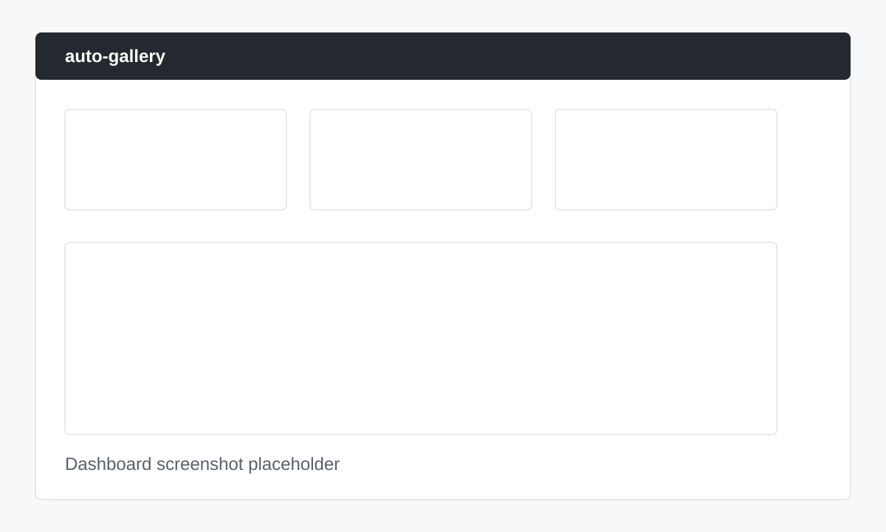
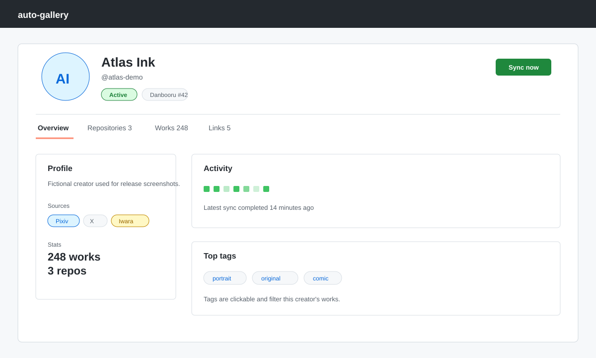
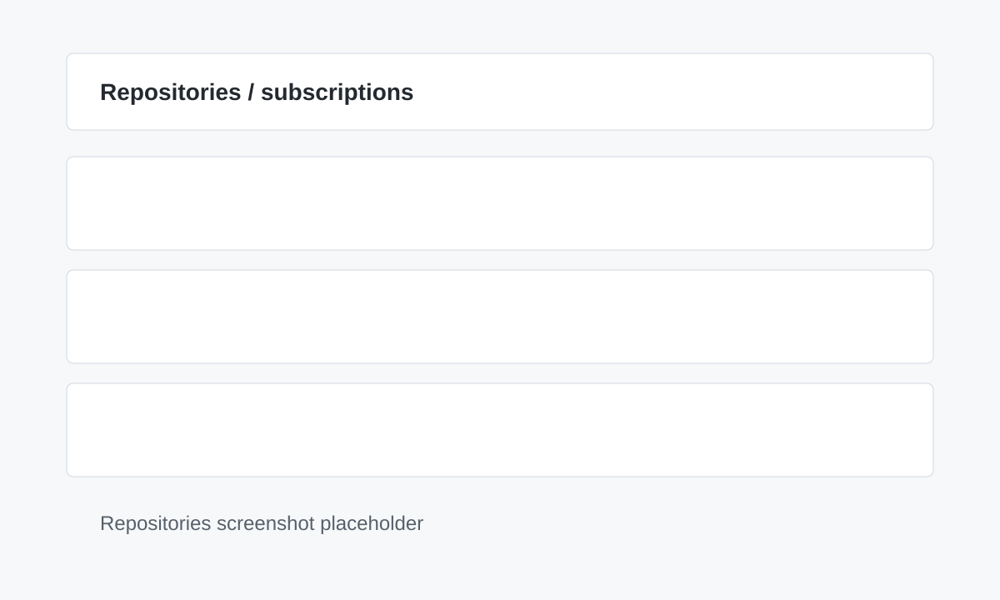
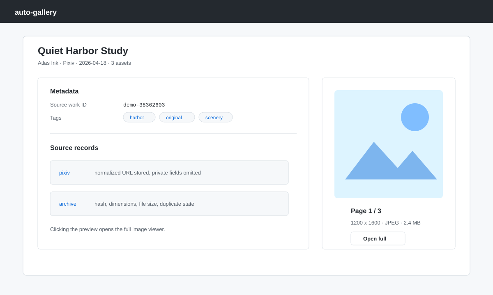
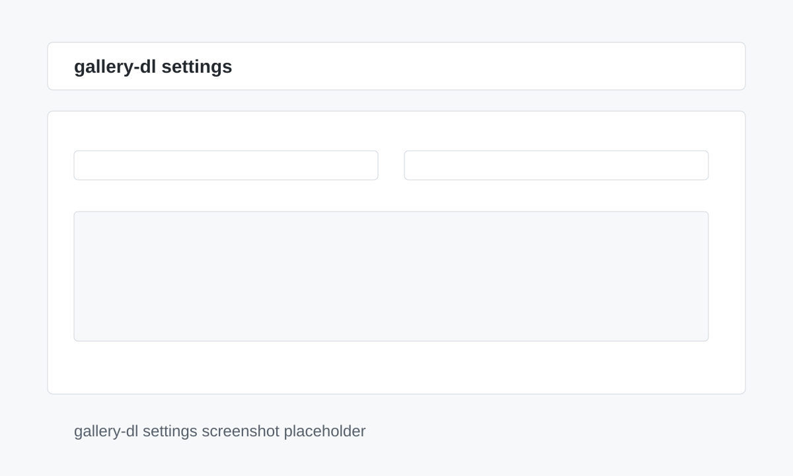

# auto-gallery

[English version](README.md)


面向个人 NAS / Linux 主机的自托管、局域网优先、多来源媒体归档与画廊管理系统。

auto-gallery 通过 Docker Compose 运行，使用 gallery-dl 下载、导入、索引并管理以创作者为中心的媒体库。管理后台采用 GitHub-like 信息架构，覆盖创作者、订阅 URL、作品、任务、搜索、调度器、gallery-dl 配置和数据管理。

> Beta 提示：auto-gallery 面向个人自托管归档场景。不要把管理后台或后端 API 直接暴露到公网。

## 截图

| 仪表盘 | 创作者详情 |
|---|---|
|  |  |

| Repositories / 订阅 | 作品详情 | gallery-dl 设置 |
|---|---|---|
|  |  |  |

上方 SVG 是基于虚构数据制作的脱敏演示截图，不包含真实创作者、凭据、本地路径或已下载媒体。

## 功能亮点

- 以创作者为中心：一个规范创作者可以绑定多个平台账号。
- GitHub-like 创作者页：Profile、活动、作品、链接和 repository 风格订阅 URL。
- 每条合法 gallery-dl 订阅 URL 都是独立同步单元。
- gallery-dl 仅在 worker 中执行，API 请求不直接 shell out。
- 导入管线支持元数据解析、哈希、标签、缩略图、搜索索引和完整性检查。
- 后台工作流覆盖订阅、调度器、任务、批量操作、去重候选、认证健康、代理、备份恢复和数据管理。
- 局域网优先：JWT 管理员登录、`.env` 默认忽略、v1 不建议公网暴露。

## 支持的来源

| 来源 | 下载方式 | 认证 | 状态 |
|---|---|---|---|
| Pixiv | gallery-dl | Refresh token 或 cookies | 已支持 |
| X/Twitter | gallery-dl `twitter` extractor | Cookies | 已支持 |
| Iwara | gallery-dl | 用户名/密码或 cookies | 已支持 |
| Danbooru | gallery-dl | API key、用户名/密码或 cookies | 已支持 |
| Weibo | gallery-dl | 可选 cookies | 已支持 |
| Bilibili | gallery-dl | 公开内容 | 已支持 |
| Pinterest | gallery-dl | 公开内容 | 已支持 |
| LOFTER | gallery-dl | 公开内容 | 已支持 |
| 本地文件夹 | 直接导入 | 本地路径 | 计划中 |
| 手动上传 | 管理后台 | 管理员 | 计划中 |

Provider 兼容性依赖 gallery-dl 和目标站点行为。详见
[docs/providers.zh.md](docs/providers.zh.md) 与
[docs/gallerydl-config.zh.md](docs/gallerydl-config.zh.md)。

## 快速开始

```bash
git clone <repo-url> auto-gallery
cd auto-gallery

cp .env.example .env
# 编辑 .env：替换服务密钥、设置端口、时区和宿主机路径。
# ADMIN_PASSWORD 可保留 change-me-admin 用于首次登录，登录后会强制修改。

docker compose up -d
docker compose exec backend alembic upgrade head

curl http://localhost:8818/api/v1/system/health
```

打开管理后台：

```text
http://<host>:13000
```

完整部署文档见 [docs/setup.zh.md](docs/setup.zh.md)。

## 首次部署 Checklist

- 复制 `.env.example` 为 `.env`。
- 替换 `POSTGRES_PASSWORD`、`REDIS_PASSWORD`、`MEILI_MASTER_KEY` 和 `SECRET_KEY`。
- 首次登录账号为 `admin / change-me-admin`；也可以部署前把 `ADMIN_PASSWORD` 改成自定义初始密码。登录后系统会强制修改密码。
- 设置 downloads、library、app config、gallery-dl config 和服务数据的宿主机路径。
- 设置 `TIMEZONE`，确保调度器按预期运行。
- 启动 Docker Compose。
- 运行 Alembic 迁移。
- 访问 `/api/v1/system/health` 检查后端健康。
- 登录管理后台。
- 在 Settings 配置 gallery-dl 凭据和命名模板。
- 创建创作者和订阅 URL，先做小规模同步验证。
- 大规模导入前确认备份和恢复预期。

## 架构

```text
Sources
  -> gallery-dl worker jobs
    -> gallery-dl job output
      -> Original Media Store (DOWNLOAD_ROOT)
        -> Library Index (LIBRARY_ROOT metadata + thumbnails)
          -> PostgreSQL canonical data
          -> Meilisearch full-text index
          -> Next.js admin web
```

核心模型与来源无关：`creator`、`work`、`asset`、`tag` 和 subscription sources。Provider 模块负责 URL 校验、normalize、gallery-dl 配置和元数据解析。

更多细节见 [docs/architecture.zh.md](docs/architecture.zh.md)。

## 文档

- [部署](docs/setup.zh.md)
- [架构](docs/architecture.zh.md)
- [Provider 指南](docs/providers.zh.md)
- [gallery-dl 配置](docs/gallerydl-config.zh.md)
- [开发](docs/development.zh.md)
- [分发与隐私](docs/distribution.zh.md)
- [风险登记](docs/risks.zh.md)
- [Release checklist](docs/release-checklist.md)
- [安全策略](SECURITY.md)
- [贡献指南](CONTRIBUTING.md)

## 已知限制

- 来源站点可能随时变化，导致 gallery-dl extractor 失效。
- gallery-dl 版本变化可能影响输出元数据和解析行为。
- Cookies、refresh token 和平台凭据需要用户自行维护。
- 大规模首次同步会耗时较长，并可能给 NAS 磁盘带来较高 I/O。
- 搜索索引可能短暂滞后于 PostgreSQL，需要等待或重建索引。
- v1 是局域网优先、管理员导向，不是公开多租户服务。

## 合法与负责任使用

auto-gallery 用于归档你有权访问和下载的内容。你需要自行遵守来源平台条款、版权法律和所在地法律。

本项目不鼓励绕过付费墙、DRM、访问控制、速率限制或平台限制。不要在 issue 或 PR 中公开 cookies、凭据、私有创作者 URL、私有媒体或数据库备份。

## Roadmap

- 增加更多脱敏演示截图和简短工作流视频。
- 增强 provider 兼容性 smoke tests。
- 完善备份/恢复校验。
- 支持本地文件夹导入和手动上传。
- 在局域网优先的管理端稳定后，再扩展可选远程客户端能力。

## License

auto-gallery 使用 `AGPL-3.0-only` 许可证。详见 [LICENSE](LICENSE)。
